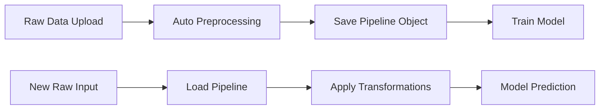

# Preprocessing Pipeline Guide

## Overview

The MLOPT application now includes a **comprehensive preprocessing pipeline system** that bridges the gap between raw user input data and the preprocessed format that trained models expect. This is critical for real-world ML deployments where models need to make predictions on new, raw data.

## Problem Statement

When training ML models:
1. **Raw data** is uploaded (e.g., `Age`, `Income`, `City`)
2. **Preprocessing** transforms it (imputation, encoding, feature engineering)
3. **Model** trains on preprocessed data (e.g., `Age`, `Income`, `City_NewYork`, `City_LA`, `Income_log`)

**Challenge**: When making predictions, users provide raw data, but the model expects preprocessed columns!

## Solution: Dynamic Preprocessing Pipelines

### How It Works



### Pipeline Types

#### 1. Auto-Preprocessing Pipeline
Saved automatically when data is processed via `/api/upload-file`

**Captures:**
- Original column names
- Missing value indicators
- Date column detection & parsing
- Feature engineering (date features, log transforms, sqrt, etc.)
- One-hot encoding mappings
- Imputation values (categorical modes, numeric medians)
- Outlier bounds

**File**: `processed_{filename}_pipeline.joblib`

#### 2. Custom Transformation Pipeline
Saved when users apply custom transformations via `/custom-preprocessing/apply-transformations`

**Captures:**
- Original column names
- User-selected transformations
- Column drops
- Data type conversions
- Custom feature engineering

**File**: `transformed_{uuid}_{filename}_pipeline.joblib`

## Technical Implementation

### Backend Components

#### 1. Pipeline Saving (`data_preprocessing.py`)

```python
# Comprehensive pipeline structure
preprocessing_pipeline = {
    "pipeline_type": "auto_preprocessing",
    "original_columns": ["Age", "Income", "City"],
    "categorical_modes": {"City": "NewYork"},
    "numeric_medians": {"Age": 35.0, "Income": 50000.0},
    "one_hot_columns": {
        "City": ["City_LA", "City_Chicago"]
    },
    "numeric_transformations": {
        "Income": ["Income_log", "Income_sqrt"]
    },
    "date_feature_mappings": {
        "DateOfBirth": ["DateOfBirth_year", "DateOfBirth_month"]
    }
}
```

#### 2. Pipeline Loading (`preprocessing_pipeline_loader.py`)

```python
def preprocess_for_prediction(raw_data_dict, file_id, processed_folder):
    """
    Load pipeline and transform raw input to model-ready format
    
    Args:
        raw_data_dict: {"Age": 30, "Income": 45000, "City": "Boston"}
        file_id: ID of the training data file
        processed_folder: Path to processed files
    
    Returns:
        DataFrame with preprocessed columns ready for model.predict()
    """
```

**Transformation Steps:**
1. Validate input columns
2. Handle missing values (apply saved modes/medians)
3. Parse dates and extract features
4. Apply one-hot encoding
5. Apply numeric transformations
6. Cap outliers
7. Ensure all expected columns exist

#### 3. Prediction Endpoint (`ml_training.py`)

```python
@router.post("/predict/")
async def predict_with_model(
    config_id: str,
    model_name: str,
    input_data: str,  # Raw JSON
    file_id: str = None  # Pipeline identifier
):
    # Load model
    model = joblib.load(model_file)
    
    # Apply preprocessing pipeline
    preprocessed_df = preprocess_for_prediction(
        inputs, file_id, processed_folder
    )
    
    # Make prediction
    prediction = model.predict(preprocessed_df)[0]
```

## Usage Example

### Step 1: Upload and Preprocess Data

```bash
POST /api/upload-file
Body: {
    "file": "customer_data.csv"
}

# Returns file_id: "abc123"
# Saves: processed_abc123.csv
# Saves: processed_abc123_pipeline.joblib  ← PIPELINE SAVED
```

### Step 2: Train Model

```bash
POST /ml/train/
Body: {
    "file_id": "abc123",
    "target_column": "Churn",
    "problem_type": "classification"
}

# Model trains on preprocessed data
# Model saved to: models/{config_id}/RandomForest.pkl
```

### Step 3: Make Prediction with Raw Data

```bash
POST /ml/predict/
Body: {
    "config_id": "xyz789",
    "model_name": "RandomForest",
    "file_id": "abc123",  ← PIPELINE LOADED HERE
    "input_data": {
        "Age": 28,
        "Income": 35000,
        "City": "Boston",
        "SignupDate": "2024-01-15"
    }
}

# Pipeline transforms raw input:
# 1. Imputes missing values
# 2. Parses SignupDate → SignupDate_year, SignupDate_month, etc.
# 3. One-hot encodes City → City_Boston (if trained), City_LA, etc.
# 4. Applies Income_log, Income_sqrt transformations
# 5. Model receives expected columns
```

## API Response

```json
{
    "success": true,
    "prediction": 0,
    "confidence": 0.87,
    "model_name": "RandomForest",
    "pipeline_applied": true,
    "preprocessed_shape": [1, 45],
    "input_data": {
        "Age": 28,
        "Income": 35000,
        "City": "Boston"
    }
}
```

## Key Features

### ✅ Robust Transformation Tracking
- Captures **all** preprocessing steps (auto + custom)
- Stores imputation values for reproducibility
- Handles one-hot encoding intelligently (missing categories = 0)
- Preserves numeric transformations (log, sqrt, binning)

### ✅ Intelligent Column Handling
- Missing columns in raw input → filled with NaN, then imputed
- Extra columns in raw input → ignored
- Column order doesn't matter (auto-aligned)

### ✅ Fallback Mechanisms
- Pipeline not found → uses raw data (with warning)
- Transformation fails → logs error, continues with partial data
- Invalid input → clear error messages

### ✅ Multiple Pipeline Support
- Auto-preprocessing pipeline (always created)
- Custom transformation pipeline (optional)
- Pipelines applied in sequence

## File Storage Structure

```
server/
├── processed_files/
│   ├── processed_abc123.csv
│   ├── processed_abc123_pipeline.joblib  ← AUTO PIPELINE
├── preprocessing_results/
│   ├── transformed_xyz789_data.csv
│   ├── transformed_xyz789_data_pipeline.joblib  ← CUSTOM PIPELINE
├── models/
│   └── config_123/
│       ├── RandomForest.pkl
│       └── leaderboard.csv
```

## Error Handling

### Common Issues

#### 1. Pipeline Not Found
```python
FileNotFoundError: Preprocessing pipeline not found for file_id: abc123
```
**Solution**: Ensure file_id matches the original upload

#### 2. Column Mismatch
```python
WARNING: Missing columns in raw data: ['Income']
```
**Solution**: Pipeline fills missing columns with NaN → imputes with saved median

#### 3. Transformation Failure
```python
WARNING: Error applying transformations to Income: division by zero
```
**Solution**: Pipeline logs warning, continues with original column

## Best Practices

### For Users
1. **Always provide `file_id`** when making predictions
2. **Use same column names** as training data
3. **Provide data in raw format** (no need to manually preprocess)

### For Developers
1. **Test pipeline on sample data** before deployment
2. **Log all transformations** for debugging
3. **Handle edge cases** (missing categories, extreme values)
4. **Version pipelines** if changing preprocessing logic

## Troubleshooting

### Pipeline Not Applied
```python
# Check if pipeline exists
import joblib
from pathlib import Path

pipeline_path = Path("processed_files") / "processed_abc123_pipeline.joblib"
if pipeline_path.exists():
    pipeline = joblib.load(pipeline_path)
    print(pipeline.keys())
```

### Debug Transformation
```python
# Load and inspect pipeline
pipeline = joblib.load("processed_abc123_pipeline.joblib")

print("Original columns:", pipeline["original_columns"])
print("Categorical modes:", pipeline["categorical_modes"])
print("Numeric medians:", pipeline["numeric_medians"])
print("One-hot columns:", pipeline["one_hot_columns"])
```

## Future Enhancements

- [ ] Pipeline versioning (track changes over time)
- [ ] Pipeline export/import (share across environments)
- [ ] Pipeline visualization (show transformation flow)
- [ ] Pipeline testing (validate on sample data)
- [ ] Multi-step custom pipelines (sklearn Pipeline integration)

## Technical Notes

### Why Joblib?
- Efficient serialization of complex Python objects
- Handles NumPy arrays, pandas DataFrames
- Standard in scikit-learn ecosystem

### Why Store Imputation Values?
- KNN imputation requires full dataset (not available at inference)
- Mode/median values ensure consistency with training
- Faster inference (no recalculation needed)

### Why Store Column Mappings?
- One-hot encoding creates new columns
- Model expects exact column names and order
- Missing categories handled gracefully (set to 0)

## Conclusion

The preprocessing pipeline system enables **production-ready ML predictions** by automatically transforming raw user input into the exact format that trained models expect. This eliminates manual preprocessing, reduces errors, and makes the system user-friendly for non-technical users.

---

**Status**: ✅ Implemented and Ready
**Files Modified**:
- `data_preprocessing.py` (pipeline saving)
- `custom_preprocessing.py` (custom pipeline saving)
- `preprocessing_pipeline_loader.py` (pipeline application)
- `ml_training.py` (prediction endpoint enhancement)
